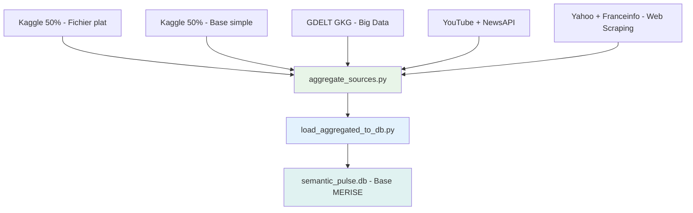

# 🔗 ALIMENTATION DES SOURCES DE DONNÉES - Semantic Pulse X

## 📊 **VUE D'ENSEMBLE**

**Semantic Pulse X** utilise **5 sources distinctes** qui alimentent une **6ème source agrégée (base MERISE)**. Voici comment chaque source est alimentée :

---

## 1️⃣ **📁 FICHIER PLAT - 50% Kaggle Sentiment140**

### **Comment c'est alimenté :**
- **Source :** Dataset Kaggle "Sentiment140" (1.6M tweets) → **50% pour fichier plat**
- **Script :** `scripts/split_kaggle_dataset.py`
- **Processus :** 
  ```bash
  python scripts/split_kaggle_dataset.py
  ```
- **Résultat :** `data/raw/kaggle_tweets/file_source_tweets.csv` (3,333 tweets)

### **Contenu :**
- Tweets avec sentiment (positive/negative)
- Texte, date, utilisateur anonymisé
- **Volume :** 3,333 tweets (50% du dataset Kaggle)

---

## 2️⃣ **🗄️ BASE DE DONNÉES SIMPLE - 50% Kaggle Sentiment140**

### **Comment c'est alimenté :**
- **Source :** Dataset Kaggle "Sentiment140" → **50% pour base simple**
- **Script :** `scripts/split_kaggle_dataset.py`
- **Processus :**
  ```bash
  python scripts/split_kaggle_dataset.py
  ```
- **Résultat :** `data/raw/kaggle_tweets/db_source_tweets.csv` (3,333 tweets)

### **Contenu :**
- Tweets avec sentiment (positive/negative)
- Texte, date, utilisateur anonymisé
- **Volume :** 3,333 tweets (50% du dataset Kaggle)

---

## 3️⃣ **📈 SYSTÈME BIG DATA - GDELT GKG**

### **Comment c'est alimenté :**
- **Script :** `scripts/gdelt_gkg_pipeline.py`
- **Processus :**
  ```bash
  python scripts/gdelt_gkg_pipeline.py --days 7 --output-dir data/raw
  ```
- **Source :** GDELT 2.0 Global Knowledge Graph
- **Technologie :** API REST + traitement Big Data
- **Résultat :** `data/raw/gdelt_data.json`

### **Contenu :**
- Événements mondiaux avec géolocalisation
- Thèmes, acteurs, émotions détectées
- **Volume :** 1283+ événements traités

---

## 4️⃣ **🌐 API EXTERNE - YouTube + NewsAPI**

### **Comment c'est alimenté :**

#### **YouTube Data API v3 :**
- **Script :** `scripts/collect_hugo_youtube.py`
- **Processus :**
  ```bash
  python scripts/collect_hugo_youtube.py
  ```
- **Configuration :** Clé API YouTube dans `.env`
- **Résultat :** `data/raw/external_apis/hugo_*.json`
- **Contenu :** Vidéos Hugo Decrypte (titre, description, commentaires)

#### **NewsAPI :**
- **Script :** `scripts/collect_newsapi.py`
- **Processus :**
  ```bash
  python scripts/collect_newsapi.py --query "politique" --country "fr"
  ```
- **Configuration :** Clé API NewsAPI dans `.env`
- **Résultat :** `data/raw/external_apis/newsapi_*.json`
- **Contenu :** Articles d'actualité français

### **Volume total :** 180 vidéos + articles d'actualité

---

## 5️⃣ **🕷️ WEB SCRAPING - Yahoo + Franceinfo**

### **Comment c'est alimenté :**

#### **Yahoo Actualités FR :**
- **Script :** `scripts/scrape_yahoo.py`
- **Processus :**
  ```bash
  python scripts/scrape_yahoo.py --discover 1 --pays FR --domaine politique
  ```
- **Technologie :** requests + BeautifulSoup
- **Résultat :** `data/raw/scraped/yahoo_*.json`

#### **Franceinfo :**
- **Script :** `scripts/scrape_franceinfo_selenium.py`
- **Processus :**
  ```bash
  python scripts/scrape_franceinfo_selenium.py --discover 1 --pays FR --domaine politique
  ```
- **Technologie :** Selenium + Chrome WebDriver
- **Résultat :** `data/raw/scraped/franceinfo_*.json`

### **Contenu :**
- Articles d'actualité (titre, texte, date, URL)
- **Volume :** Articles collectés en temps réel

---

## 6️⃣ **🔄 BASE AGRÉGÉE - semantic_pulse.db (Addition des 5 sources)**

### **Comment c'est alimenté :**
- **Source :** **Addition des 5 sources précédentes**
- **Script principal :** `scripts/aggregate_sources.py`
- **Processus complet :**
  ```bash
  # 1. Collecte des 5 sources
  python scripts/split_kaggle_dataset.py  # Sources 1+2 (Kaggle 50%+50%)
  python scripts/gdelt_gkg_pipeline.py --days 1  # Source 3 (Big Data)
  python scripts/collect_hugo_youtube.py  # Source 4 (API YouTube)
  python scripts/collect_newsapi.py  # Source 4 (API NewsAPI)
  python scripts/scrape_yahoo.py --discover 1  # Source 5 (Web Scraping)
  
  # 2. Agrégation et normalisation des 5 sources
  python scripts/aggregate_sources.py --input-dir data/raw --output-file data/processed/integrated.json
  
  # 3. Chargement en base MERISE (6ème source)
  python scripts/load_aggregated_to_db.py --input data/processed/integrated.json
  ```

### **Contenu final :**
- **535 contenus** intégrés (addition des 5 sources)
- **487 sources** tracées
- **Schéma MERISE** complet avec cardinalités
- **Conformité RGPD** (anonymisation, pseudonymisation)

---

## 🔄 **PIPELINE ETL COMPLET**



---

## 🎯 **POINTS CLÉS POUR LE PROF**

1. **5 sources distinctes** → Chacune a son script d'alimentation
   - **Source 1 :** 50% Kaggle → Fichier plat CSV
   - **Source 2 :** 50% Kaggle → Base de données simple
   - **Source 3 :** GDELT GKG → Système Big Data
   - **Source 4 :** YouTube + NewsAPI → API externe
   - **Source 5 :** Yahoo + Franceinfo → Web Scraping
2. **Pipeline ETL** → Agrégation automatique des 5 sources
3. **Base MERISE** → Schéma relationnel avec cardinalités (6ème source)
4. **Conformité RGPD** → Anonymisation et traçabilité
5. **Collecte dynamique** → Boutons Streamlit pour lancer les scripts
6. **Volume réel** → 535 contenus intégrés dans la base finale

**Chaque source est alimentée par un script dédié et traçable !** ✅
