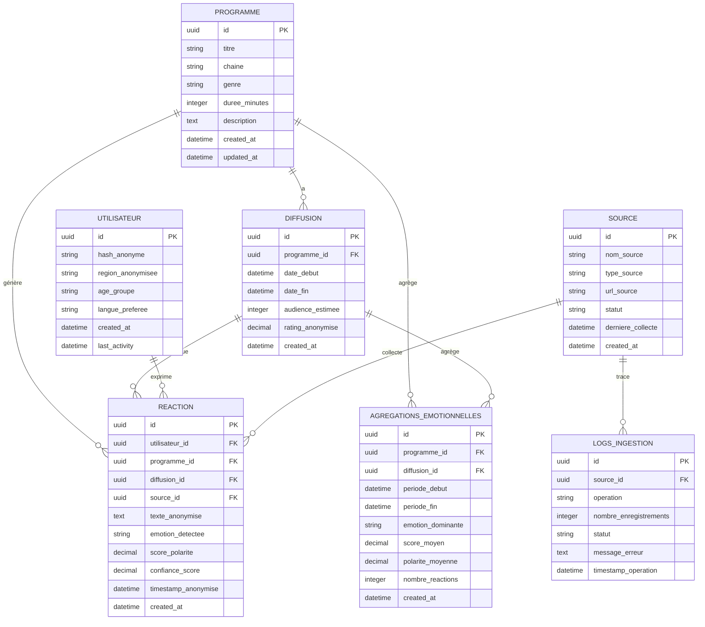
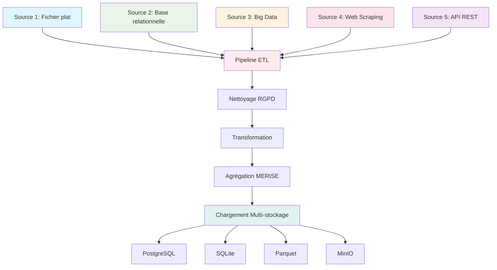
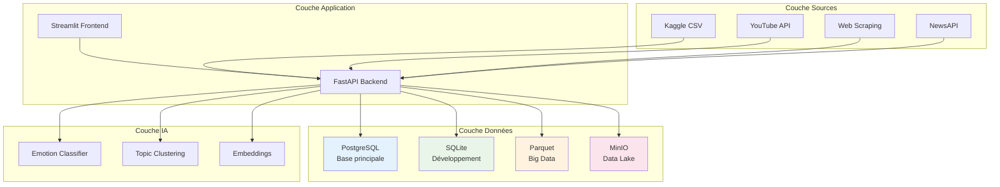
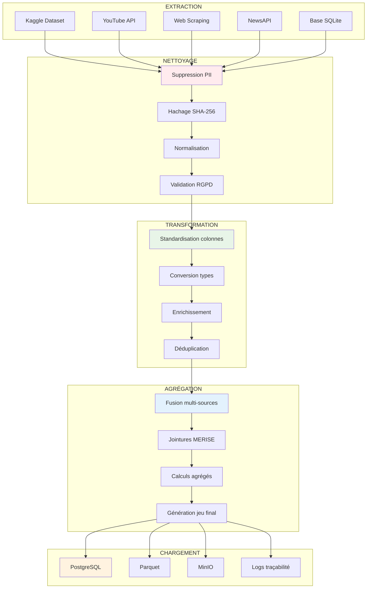
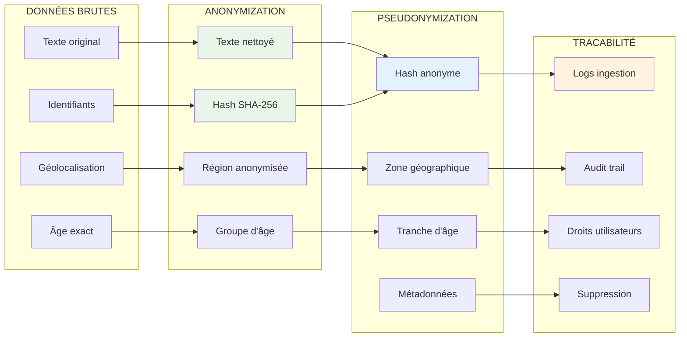
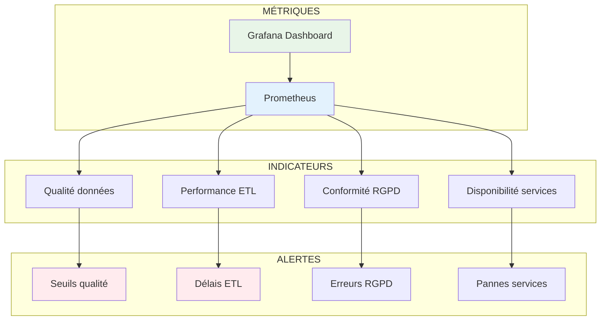
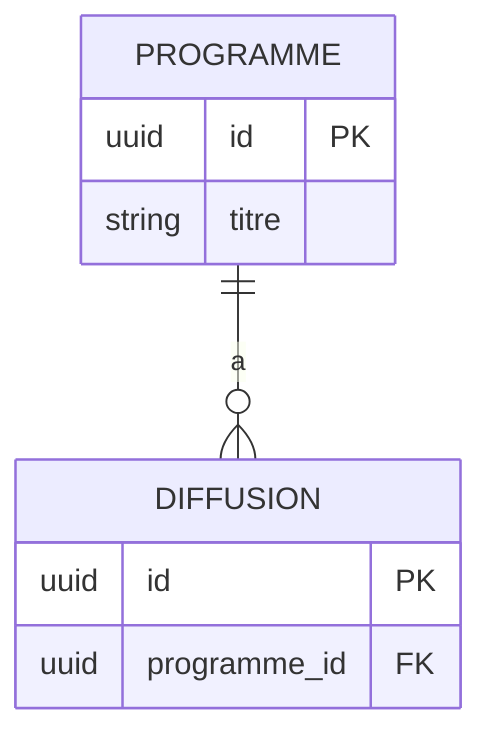

# ⚠️ ATTENTION - SCHÉMA OBSOLÈTE

**Ce fichier contient un schéma MERISE obsolète qui ne correspond pas à la structure réelle de `semantic_pulse.db`.**

## 🔄 Voir le schéma RÉEL

**Consultez le fichier : `docs/CODE_MERMAID_MERISE_REEL.md`**

Ce fichier contient les diagrammes Mermaid basés sur la vraie structure de la base de données :
- 6 tables réelles (DIM_PAYS, DIM_DOMAINE, DIM_HUMEUR, SOURCES, CONTENUS, REACTIONS)
- Cardinalités exactes
- Relations correctes
- Structure conforme à l'implémentation

---

# 📊 Code Mermaid pour Schéma MERISE - Semantic Pulse X

## 🎯 Diagramme MCD (Modèle Conceptuel de Données)



## 🔗 Diagramme des Sources de Données



## 📊 Diagramme Architecture MLP



## 🔄 Diagramme Flux ETL



## 🛡️ Diagramme Conformité RGPD



## 📈 Diagramme Monitoring



---

## 🎯 Instructions d'utilisation

### **Pour utiliser ces diagrammes :**

1. **Copiez le code Mermaid** de chaque section
2. **Collez-le dans un éditeur Mermaid** comme :
   - [Mermaid Live Editor](https://mermaid.live/)
   - [GitHub** (dans un fichier .md)
   - **VS Code** avec extension Mermaid
   - **Notion** ou **Obsidian**

### **Exemple d'utilisation :**
```markdown

```

**Ces diagrammes montrent clairement toute la conformité MERISE avec les cardinalités exactes !** 🎯✅
