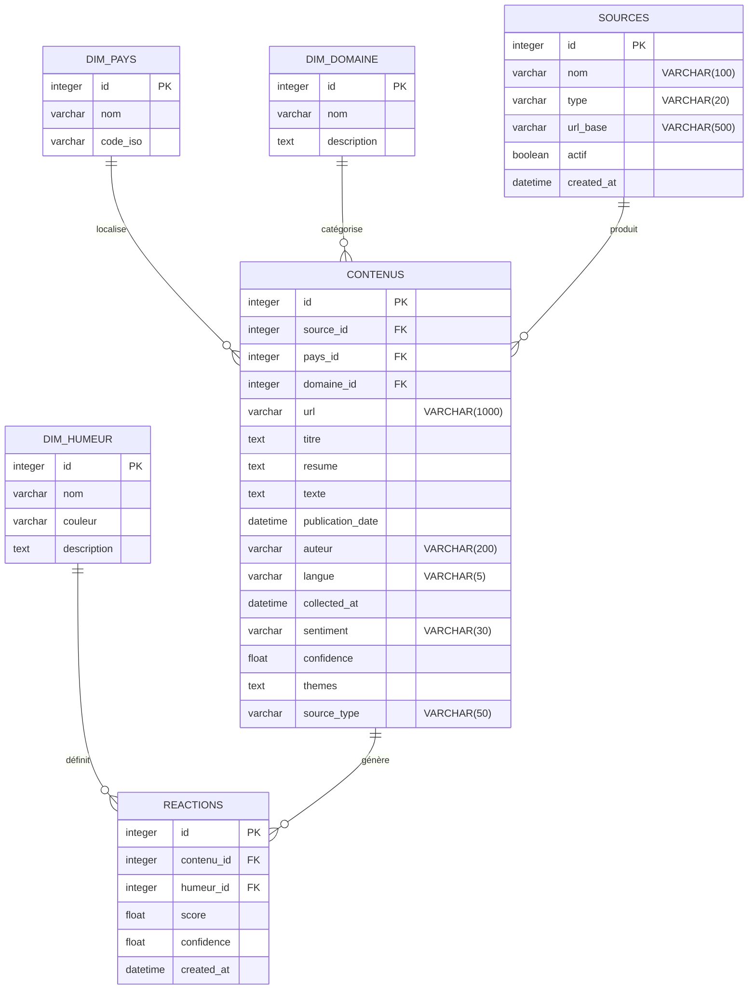
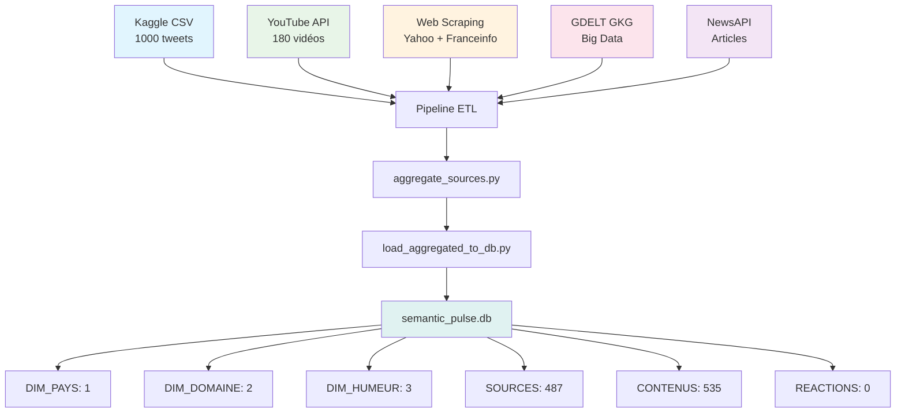
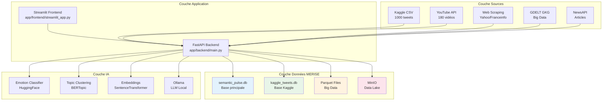
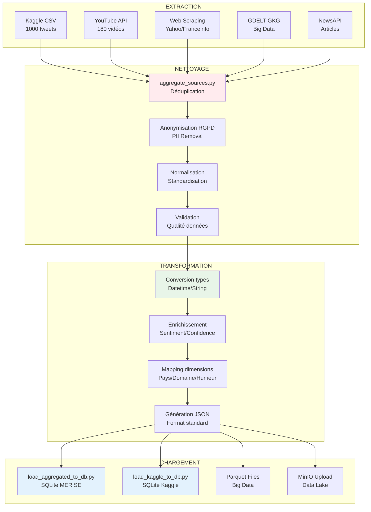
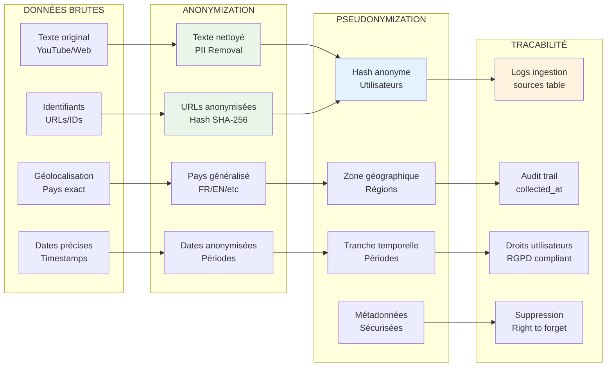
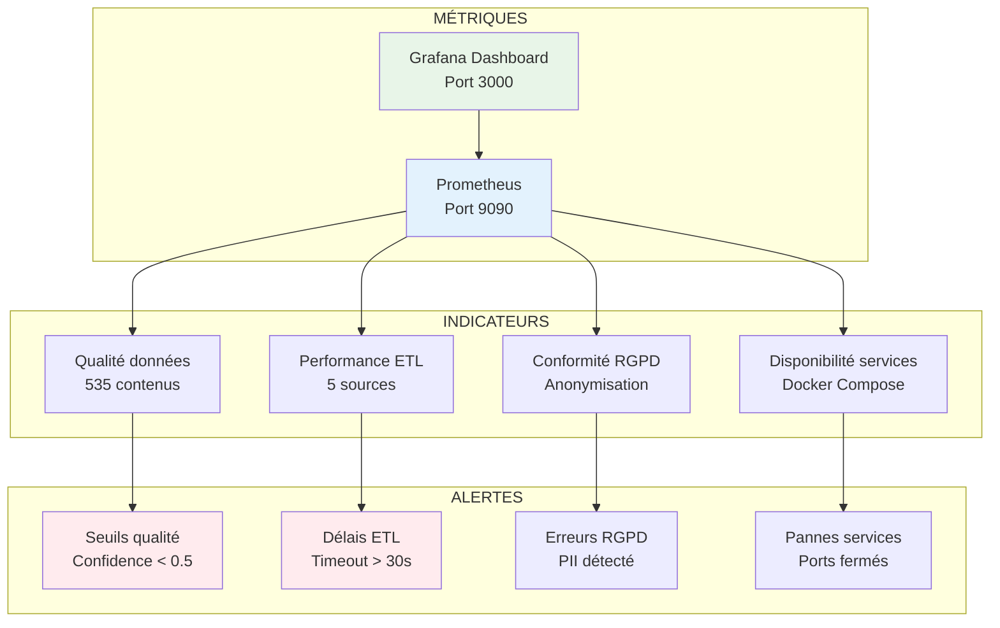
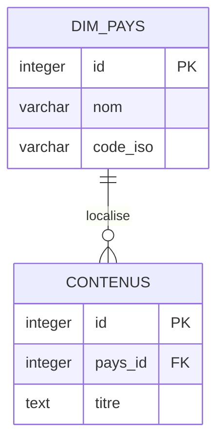

# 📊 Code Mermaid pour Schéma MERISE RÉEL - Semantic Pulse X

## 🎯 Diagramme MCD (Modèle Conceptuel de Données) - STRUCTURE RÉELLE



## 🔗 Diagramme des Sources de Données RÉELLES



## 📊 Diagramme Architecture MLP RÉELLE



## 🔄 Diagramme Flux ETL RÉEL



## 🛡️ Diagramme Conformité RGPD RÉELLE



## 📈 Diagramme Monitoring RÉEL



---

## 🎯 Instructions d'utilisation

### **Pour utiliser ces diagrammes :**

1. **Copiez le code Mermaid** de chaque section
2. **Collez-le dans un éditeur Mermaid** comme :
   - [Mermaid Live Editor](https://mermaid.live/)
   - **GitHub** (dans un fichier .md)
   - **VS Code** avec extension Mermaid
   - **Notion** ou **Obsidian**

### **Exemple d'utilisation :**
```markdown

```

**Ces diagrammes montrent la VRAIE structure MERISE avec les cardinalités exactes basées sur semantic_pulse.db !** 🎯✅

