# 🗄️ Schéma Base de Données Relationnelle - Semantic Pulse X

## 📊 Schéma Mermaid

```mermaid
erDiagram
    %% Entités principales - MCD Merise
    PROGRAMMES {
        uuid id PK
        string titre
        string chaine
        string genre
        integer duree_minutes
        text description
        datetime created_at
        datetime updated_at
    }
    
    DIFFUSIONS {
        uuid id PK
        uuid programme_id FK
        datetime date_debut
        datetime date_fin
        integer audience_estimee
        float rating_anonymise
        datetime created_at
    }
    
    UTILISATEURS {
        uuid id PK
        string hash_anonyme UK
        string region_anonymisee
        string age_groupe
        string langue_preferee
        datetime created_at
        datetime last_activity
    }
    
    REACTIONS {
        uuid id PK
        uuid programme_id FK
        uuid diffusion_id FK
        uuid utilisateur_id FK
        uuid source_id FK
        text texte_anonymise
        string langue
        string emotion_principale
        float score_emotion
        float polarite
        float confiance
        datetime timestamp
        datetime created_at
    }
    
    SOURCES {
        uuid id PK
        string nom
        string type_source
        string url
        jsonb configuration
        boolean actif
        datetime last_sync
        datetime created_at
    }
    
    %% Tables de logs - MLD Merise
    LOGS_INGESTION {
        uuid id PK
        uuid source_id FK
        datetime date_ingestion
        integer nombre_records
        string statut
        text message
        jsonb configuration_utilisee
    }
    
    %% Tables d'agrégation - MLP Merise
    AGREGATIONS_EMOTIONNELLES {
        uuid id PK
        uuid programme_id FK
        uuid diffusion_id FK
        datetime periode_debut
        datetime periode_fin
        string emotion_dominante
        float score_moyen
        float polarite_moyenne
        integer nombre_reactions
        datetime created_at
    }
    
    %% Relations principales
    PROGRAMMES ||--o{ DIFFUSIONS : "a"
    PROGRAMMES ||--o{ REACTIONS : "génère"
    DIFFUSIONS ||--o{ REACTIONS : "provoque"
    UTILISATEURS ||--o{ REACTIONS : "exprime"
    SOURCES ||--o{ REACTIONS : "collecte"
    
    %% Relations de logs
    SOURCES ||--o{ LOGS_INGESTION : "trace"
    
    %% Relations d'agrégation
    PROGRAMMES ||--o{ AGREGATIONS_EMOTIONNELLES : "agrège"
    DIFFUSIONS ||--o{ AGREGATIONS_EMOTIONNELLES : "agrège"
```



## 🔗 Relations entre entités

### **Relations principales (MCD)**
- **Programme** (1,N) → **Diffusion** : Un programme peut avoir plusieurs diffusions
- **Programme** (1,N) → **Réaction** : Un programme génère des réactions
- **Diffusion** (1,N) → **Réaction** : Une diffusion provoque des réactions
- **Utilisateur** (1,N) → **Réaction** : Un utilisateur exprime des réactions
- **Source** (1,N) → **Réaction** : Une source collecte des réactions

### **Relations de traçabilité (MLD)**
- **Source** (1,N) → **Log Ingestion** : Une source génère des logs d'ingestion

### **Relations d'agrégation (MLP)**
- **Programme** (1,N) → **Agrégation Émotionnelle** : Agrégation par programme
- **Diffusion** (1,N) → **Agrégation Émotionnelle** : Agrégation par diffusion

## 📋 Détail des tables

### **1. PROGRAMMES**
```sql
CREATE TABLE programmes (
    id UUID PRIMARY KEY DEFAULT gen_random_uuid(),
    titre VARCHAR(255) NOT NULL,
    chaine VARCHAR(100) NOT NULL,
    genre VARCHAR(50),
    duree_minutes INTEGER,
    description TEXT,
    created_at TIMESTAMP DEFAULT NOW(),
    updated_at TIMESTAMP DEFAULT NOW()
);
```

### **2. DIFFUSIONS**
```sql
CREATE TABLE diffusions (
    id UUID PRIMARY KEY DEFAULT gen_random_uuid(),
    programme_id UUID NOT NULL REFERENCES programmes(id),
    date_debut TIMESTAMP NOT NULL,
    date_fin TIMESTAMP NOT NULL,
    audience_estimee INTEGER,
    rating_anonymise FLOAT,
    created_at TIMESTAMP DEFAULT NOW()
);
```

### **3. UTILISATEURS**
```sql
CREATE TABLE utilisateurs (
    id UUID PRIMARY KEY DEFAULT gen_random_uuid(),
    hash_anonyme VARCHAR(64) UNIQUE NOT NULL,
    region_anonymisee VARCHAR(20),
    age_groupe VARCHAR(10),
    langue_preferee VARCHAR(5) DEFAULT 'fr',
    created_at TIMESTAMP DEFAULT NOW(),
    last_activity TIMESTAMP
);
```

### **4. REACTIONS**
```sql
CREATE TABLE reactions (
    id UUID PRIMARY KEY DEFAULT gen_random_uuid(),
    programme_id UUID REFERENCES programmes(id),
    diffusion_id UUID REFERENCES diffusions(id),
    utilisateur_id UUID REFERENCES utilisateurs(id),
    source_id UUID NOT NULL REFERENCES sources(id),
    texte_anonymise TEXT,
    langue VARCHAR(5) DEFAULT 'fr',
    emotion_principale VARCHAR(50),
    score_emotion FLOAT CHECK (score_emotion >= 0.0 AND score_emotion <= 1.0),
    polarite FLOAT CHECK (polarite >= -1.0 AND polarite <= 1.0),
    confiance FLOAT CHECK (confiance >= 0.0 AND confiance <= 1.0),
    timestamp TIMESTAMP NOT NULL,
    created_at TIMESTAMP DEFAULT NOW()
);
```

### **5. SOURCES**
```sql
CREATE TABLE sources (
    id UUID PRIMARY KEY DEFAULT gen_random_uuid(),
    nom VARCHAR(100) NOT NULL,
    type_source VARCHAR(20) NOT NULL CHECK (type_source IN ('file', 'sql', 'bigdata', 'scraping', 'api')),
    url VARCHAR(500),
    configuration JSONB,
    actif BOOLEAN DEFAULT TRUE,
    last_sync TIMESTAMP,
    created_at TIMESTAMP DEFAULT NOW()
);
```

### **6. LOGS_INGESTION**
```sql
CREATE TABLE logs_ingestion (
    id UUID PRIMARY KEY DEFAULT gen_random_uuid(),
    source_id UUID NOT NULL REFERENCES sources(id),
    date_ingestion TIMESTAMP NOT NULL,
    nombre_records INTEGER DEFAULT 0,
    statut VARCHAR(20) NOT NULL CHECK (statut IN ('success', 'error', 'partial')),
    message TEXT,
    configuration_utilisee JSONB
);
```

### **7. AGREGATIONS_EMOTIONNELLES**
```sql
CREATE TABLE agregations_emotionnelles (
    id UUID PRIMARY KEY DEFAULT gen_random_uuid(),
    programme_id UUID REFERENCES programmes(id),
    diffusion_id UUID REFERENCES diffusions(id),
    periode_debut TIMESTAMP NOT NULL,
    periode_fin TIMESTAMP NOT NULL,
    emotion_dominante VARCHAR(50),
    score_moyen FLOAT,
    polarite_moyenne FLOAT,
    nombre_reactions INTEGER DEFAULT 0,
    created_at TIMESTAMP DEFAULT NOW()
);
```

## 🔍 Index pour performance

```sql
-- Index sur les clés étrangères
CREATE INDEX idx_reactions_programme_id ON reactions(programme_id);
CREATE INDEX idx_reactions_diffusion_id ON reactions(diffusion_id);
CREATE INDEX idx_reactions_utilisateur_id ON reactions(utilisateur_id);
CREATE INDEX idx_reactions_source_id ON reactions(source_id);
CREATE INDEX idx_reactions_timestamp ON reactions(timestamp);

-- Index sur les colonnes de recherche
CREATE INDEX idx_programmes_chaine ON programmes(chaine);
CREATE INDEX idx_programmes_genre ON programmes(genre);
CREATE INDEX idx_reactions_emotion ON reactions(emotion_principale);
CREATE INDEX idx_sources_type ON sources(type_source);

-- Index composites
CREATE INDEX idx_reactions_emotion_timestamp ON reactions(emotion_principale, timestamp);
CREATE INDEX idx_agregations_periode ON agregations_emotionnelles(periode_debut, periode_fin);
```

## 📊 Vues pour l'analyse

### **Vue des réactions par source**
```sql
CREATE VIEW v_reactions_par_source AS
SELECT 
    s.nom as source_nom,
    s.type_source,
    COUNT(r.id) as nombre_reactions,
    AVG(r.score_emotion) as score_moyen,
    AVG(r.polarite) as polarite_moyenne
FROM sources s
LEFT JOIN reactions r ON s.id = r.source_id
GROUP BY s.id, s.nom, s.type_source;
```

### **Vue des émotions par programme**
```sql
CREATE VIEW v_emotions_par_programme AS
SELECT 
    p.titre,
    p.chaine,
    r.emotion_principale,
    COUNT(r.id) as nombre_reactions,
    AVG(r.score_emotion) as score_moyen
FROM programmes p
LEFT JOIN reactions r ON p.id = r.programme_id
GROUP BY p.id, p.titre, p.chaine, r.emotion_principale;
```

### **Vue des tendances temporelles**
```sql
CREATE VIEW v_tendances_temporelles AS
SELECT 
    DATE_TRUNC('hour', r.timestamp) as heure,
    r.emotion_principale,
    COUNT(r.id) as nombre_reactions,
    AVG(r.polarite) as polarite_moyenne
FROM reactions r
GROUP BY DATE_TRUNC('hour', r.timestamp), r.emotion_principale
ORDER BY heure DESC;
```

## 🔒 Contraintes RGPD

### **Anonymisation obligatoire**
- **Utilisateur** : Seul le hash SHA-256 est stocké
- **Texte** : Champ `texte_anonymise` uniquement
- **Géolocalisation** : Régions groupées (ex: "FR-75")
- **Âge** : Groupes d'âge (ex: "18-25")

### **Audit trail**
- **Logs d'ingestion** : Traçabilité complète des données
- **Timestamps** : Horodatage de toutes les opérations
- **Configuration** : Sauvegarde des paramètres d'ingestion

## 🚀 Performance et scalabilité

### **Partitionnement**
```sql
-- Partitionnement par date pour les réactions
CREATE TABLE reactions_2024 PARTITION OF reactions
FOR VALUES FROM ('2024-01-01') TO ('2025-01-01');

-- Partitionnement par source pour les logs
CREATE TABLE logs_ingestion_file PARTITION OF logs_ingestion
FOR VALUES IN ('file');
```

### **Archiving**
```sql
-- Table d'archivage pour les anciennes données
CREATE TABLE reactions_archive (LIKE reactions INCLUDING ALL);
```

**Le schéma de base de données relationnelle est maintenant complet avec les 5 sources intégrées !** 🗄️✅
