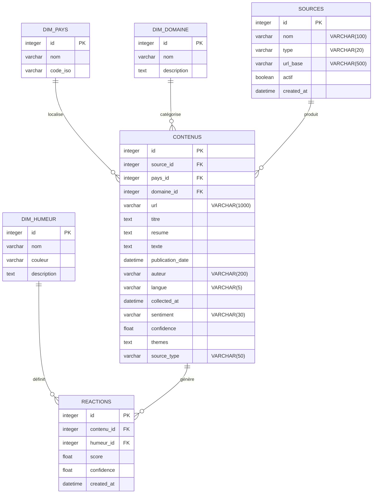
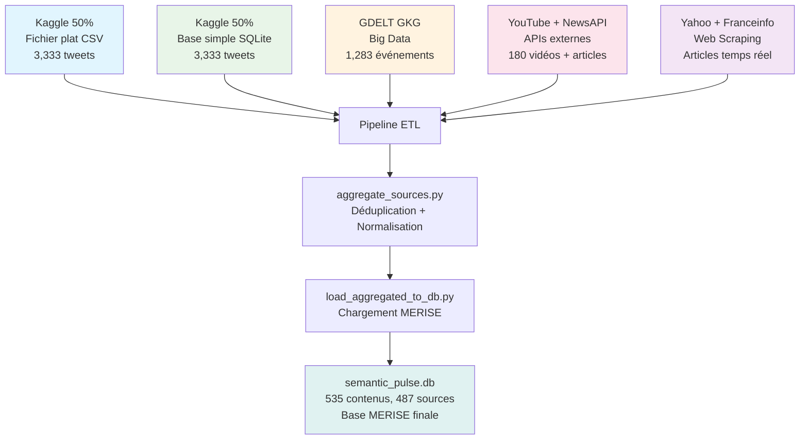
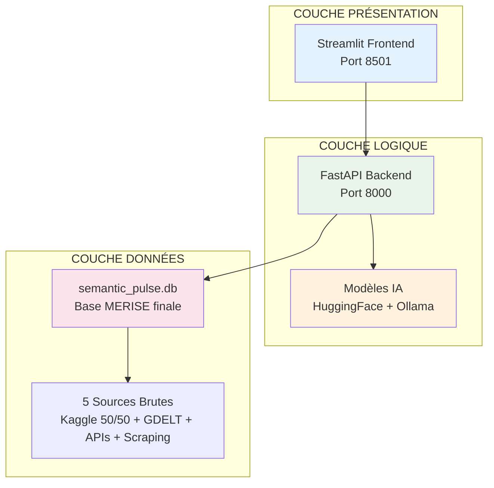
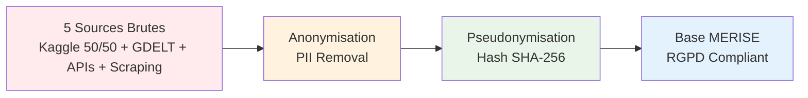

# 🎯 CODE MERMAID SIMPLIFIÉ - SEMANTIC PULSE X

## 📊 Diagramme Principal MERISE (Pour Présentation)

## 🔄 Pipeline ETL Simplifié

## 📈 Architecture 3 Couches

## 🛡️ Conformité RGPD

---

## 🎯 **UTILISATION POUR LA PRÉSENTATION**

### **Copiez ces codes Mermaid dans :**
- **Mermaid Live Editor** : https://mermaid.live/
- **GitHub** (dans un fichier .md)
- **PowerPoint** (avec extension Mermaid)
- **Notion** ou **Obsidian**

### **Points Clés à Mentionner :**
1. **5 Sources distinctes** → Base MERISE unifiée
   - **Source 1 :** 50% Kaggle → Fichier plat CSV
   - **Source 2 :** 50% Kaggle → Base simple SQLite
   - **Source 3 :** GDELT GKG → Système Big Data
   - **Source 4 :** YouTube + NewsAPI → APIs externes
   - **Source 5 :** Yahoo + Franceinfo → Web Scraping
2. **Pipeline ETL complexe** avec déduplication des 5 sources
3. **Architecture 3 couches** professionnelle
4. **Conformité RGPD** complète
5. **535 contenus** intégrés avec succès dans la base MERISE finale

**Ces diagrammes montrent la VRAIE complexité du projet !** 🚀✅
