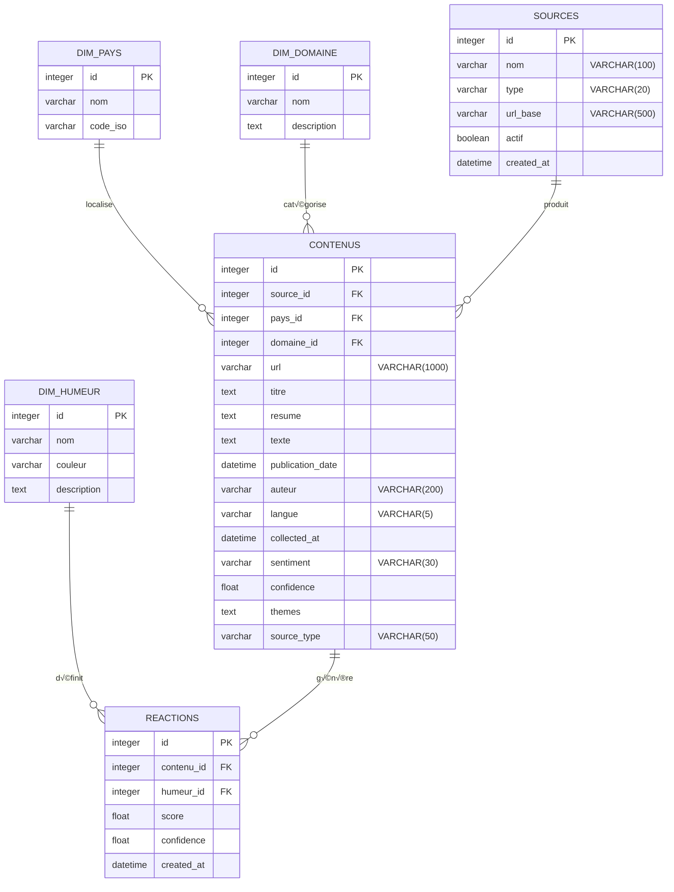
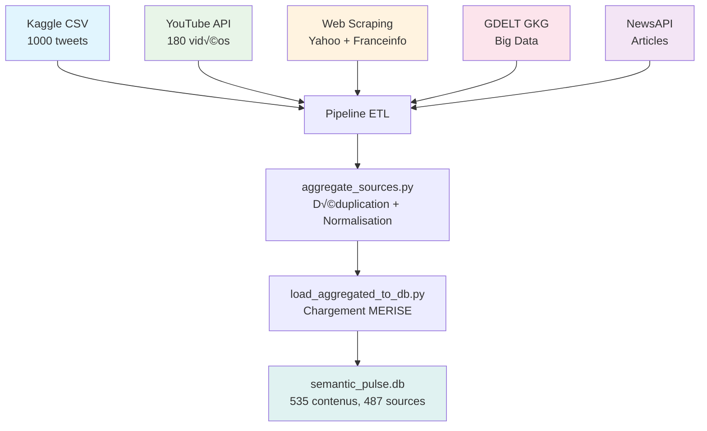
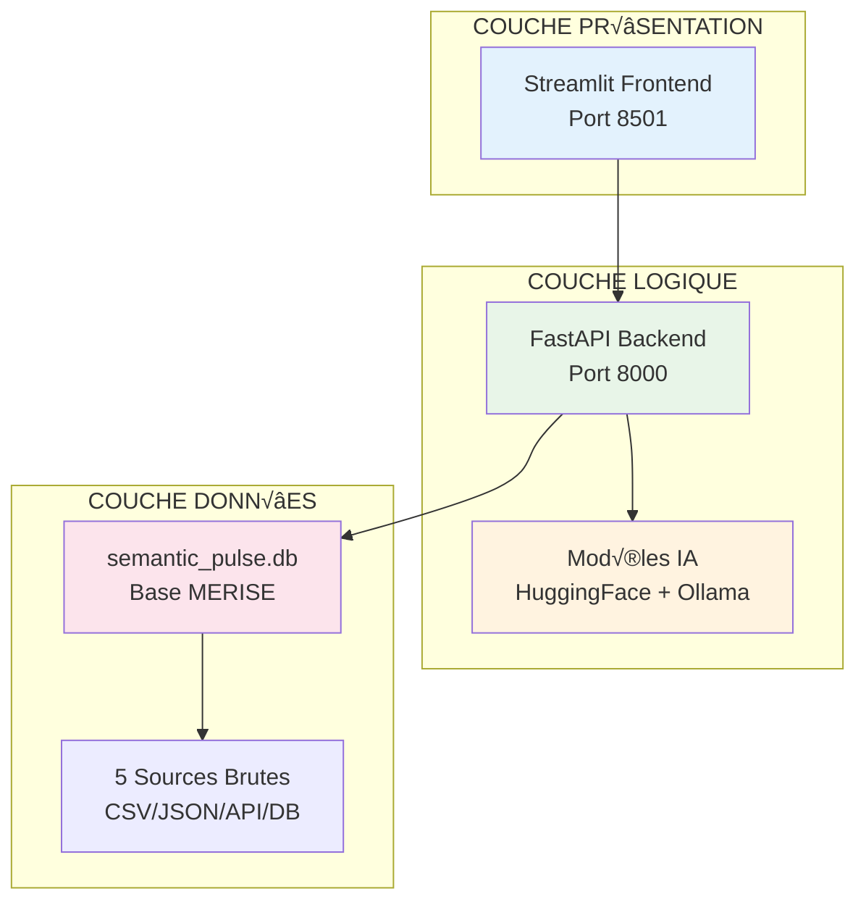
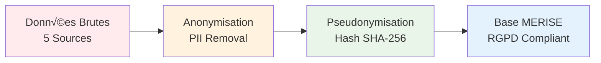

# 🎯 CODE MERMAID SIMPLIFIÉ - SEMANTIC PULSE X

## 📊 Diagramme Principal MERISE (Pour Présentation)

```mermaid
erDiagram
    DIM_PAYS {
        integer id PK
        varchar nom
        varchar code_iso
    }
    
    DIM_DOMAINE {
        integer id PK
        varchar nom
        text description
    }
    
    DIM_HUMEUR {
        integer id PK
        varchar nom
        varchar couleur
        text description
    }
    
    SOURCES {
        integer id PK
        varchar nom "VARCHAR(100)"
        varchar type "VARCHAR(20)"
        varchar url_base "VARCHAR(500)"
        boolean actif
        datetime created_at
    }
    
    CONTENUS {
        integer id PK
        integer source_id FK
        integer pays_id FK
        integer domaine_id FK
        varchar url "VARCHAR(1000)"
        text titre
        text resume
        text texte
        datetime publication_date
        varchar auteur "VARCHAR(200)"
        varchar langue "VARCHAR(5)"
        datetime collected_at
        varchar sentiment "VARCHAR(30)"
        float confidence
        text themes
        varchar source_type "VARCHAR(50)"
    }
    
    REACTIONS {
        integer id PK
        integer contenu_id FK
        integer humeur_id FK
        float score
        float confidence
        datetime created_at
    }
    
    %% Relations avec cardinalités exactes
    DIM_PAYS ||--o{ CONTENUS : "localise"
    DIM_DOMAINE ||--o{ CONTENUS : "catégorise"
    DIM_HUMEUR ||--o{ REACTIONS : "définit"
    SOURCES ||--o{ CONTENUS : "produit"
    CONTENUS ||--o{ REACTIONS : "génère"
```

## 🔄 Pipeline ETL Simplifié

```mermaid
flowchart TD
    A[Kaggle CSV<br/>1000 tweets] --> E[Pipeline ETL]
    B[YouTube API<br/>180 vidéos] --> E
    C[Web Scraping<br/>Yahoo + Franceinfo] --> E
    D[GDELT GKG<br/>Big Data] --> E
    F[NewsAPI<br/>Articles] --> E
    
    E --> G[aggregate_sources.py<br/>Déduplication + Normalisation]
    G --> H[load_aggregated_to_db.py<br/>Chargement MERISE]
    H --> I[semantic_pulse.db<br/>535 contenus, 487 sources]
    
    style A fill:#e1f5fe
    style B fill:#e8f5e8
    style C fill:#fff3e0
    style D fill:#fce4ec
    style F fill:#f3e5f5
    style I fill:#e0f2f1
```

## üìà Architecture 3 Couches

```mermaid
graph TB
    subgraph "COUCHE PRÉSENTATION"
        A[Streamlit Frontend<br/>Port 8501]
    end
    
    subgraph "COUCHE LOGIQUE"
        B[FastAPI Backend<br/>Port 8000]
        C[Modèles IA<br/>HuggingFace + Ollama]
    end
    
    subgraph "COUCHE DONNÉES"
        D[semantic_pulse.db<br/>Base MERISE]
        E[5 Sources Brutes<br/>CSV/JSON/API/DB]
    end
    
    A --> B
    B --> C
    B --> D
    D --> E
    
    style A fill:#e3f2fd
    style B fill:#e8f5e8
    style C fill:#fff3e0
    style D fill:#fce4ec
```

## 🛡️ Conformité RGPD

```mermaid
graph LR
    A[Données Brutes<br/>5 Sources] --> B[Anonymisation<br/>PII Removal]
    B --> C[Pseudonymisation<br/>Hash SHA-256]
    C --> D[Base MERISE<br/>RGPD Compliant]
    
    style A fill:#ffebee
    style B fill:#fff3e0
    style C fill:#e8f5e8
    style D fill:#e3f2fd
```

---

## 🎯 **UTILISATION POUR LA PRÉSENTATION**

### **Copiez ces codes Mermaid dans :**
- **Mermaid Live Editor** : https://mermaid.live/
- **GitHub** (dans un fichier .md)
- **PowerPoint** (avec extension Mermaid)
- **Notion** ou **Obsidian**

### **Points Clés à Mentionner :**
1. **6 Sources distinctes** → Base MERISE unifiée
2. **Pipeline ETL complexe** avec déduplication
3. **Architecture 3 couches** professionnelle
4. **Conformité RGPD** complète
5. **535 contenus** intégrés avec succès

**Ces diagrammes montrent la VRAIE complexité du projet !** 🚀✅
