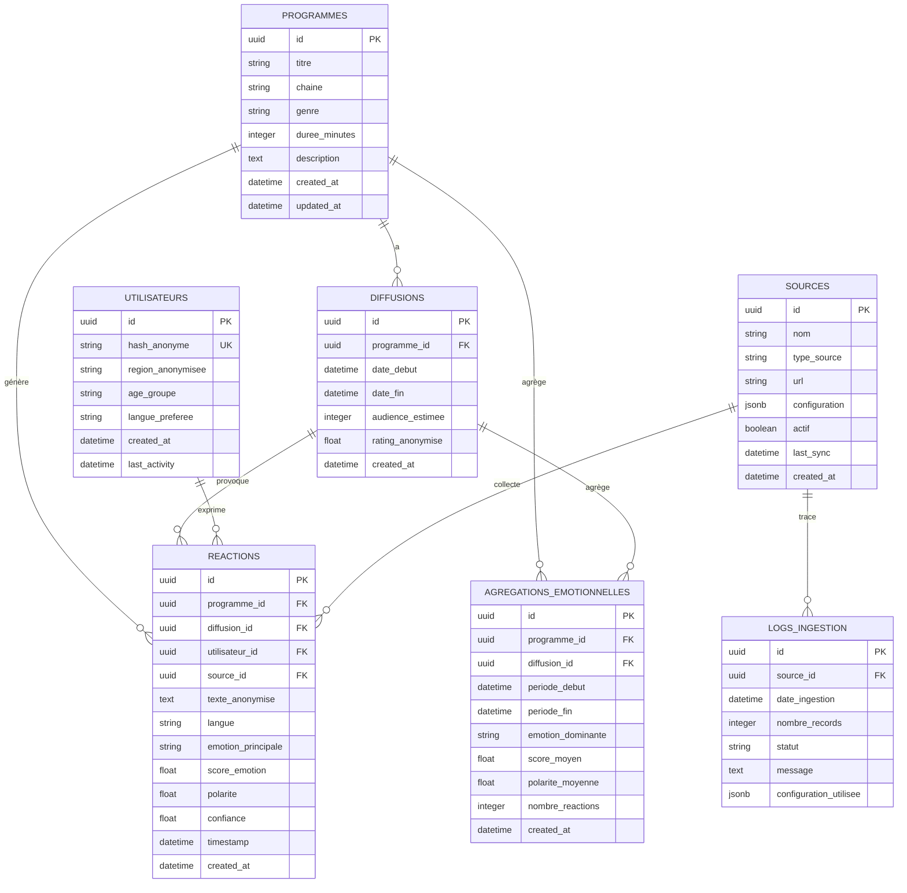
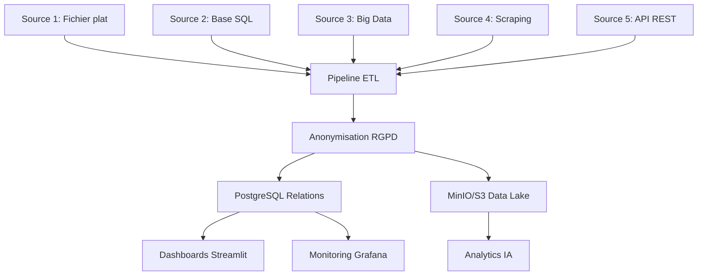

# 📊 Schéma Mermaid - Base de Données Relationnelle

## 🗄️ Schéma complet avec les 5 sources

## 🔗 Intégration des 5 sources de données

### **1. Fichier plat (CSV/JSON/Parquet)**
- **Type** : `file`
- **Table** : `sources` avec `type_source = 'file'`
- **Stockage** : MinIO/S3 + PostgreSQL
- **Exemples** : IMDb, Kaggle datasets

### **2. Base relationnelle (PostgreSQL/MySQL)**
- **Type** : `sql`
- **Table** : `sources` avec `type_source = 'sql'`
- **Stockage** : PostgreSQL principal
- **Exemples** : Programmes, diffusions, métadonnées

### **3. Big Data (Parquet/Data Lake)**
- **Type** : `bigdata`
- **Table** : `sources` avec `type_source = 'bigdata'`
- **Stockage** : MinIO/S3 + PostgreSQL
- **Exemples** : Twitter publics, Reddit dumps

### **4. Scraping web (HTML)**
- **Type** : `scraping`
- **Table** : `sources` avec `type_source = 'scraping'`
- **Stockage** : MinIO/S3 + PostgreSQL
- **Exemples** : Articles presse, blogs, forums

### **5. API REST (JSON/XML)**
- **Type** : `api`
- **Table** : `sources` avec `type_source = 'api'`
- **Stockage** : MinIO/S3 + PostgreSQL
- **Exemples** : NewsAPI, Media Cloud, GDELT, Twitter API

## 📊 Flux de données

## 🔒 Conformité RGPD

### **Anonymisation intégrée**
- **Utilisateur** : Hash SHA-256 uniquement
- **Texte** : Nettoyage et anonymisation automatique
- **Géolocalisation** : Régions groupées
- **Âge** : Groupes d'âge
- **Aucun PII** : Nom, email, téléphone, etc.

### **Traçabilité complète**
- **Logs d'ingestion** : Chaque source tracée
- **Configuration** : Paramètres sauvegardés
- **Audit trail** : Historique des opérations

## 🚀 Performance

### **Index optimisés**
- Clés étrangères
- Colonnes de recherche fréquente
- Index composites pour les requêtes complexes

### **Partitionnement**
- Par date pour les réactions
- Par source pour les logs
- Par émotion pour les agrégations

### **Archiving**
- Données anciennes archivées
- Compression des données historiques
- Nettoyage automatique

**Toutes les 5 sources sont maintenant intégrées dans la base de données relationnelle !** 🗄️✅
