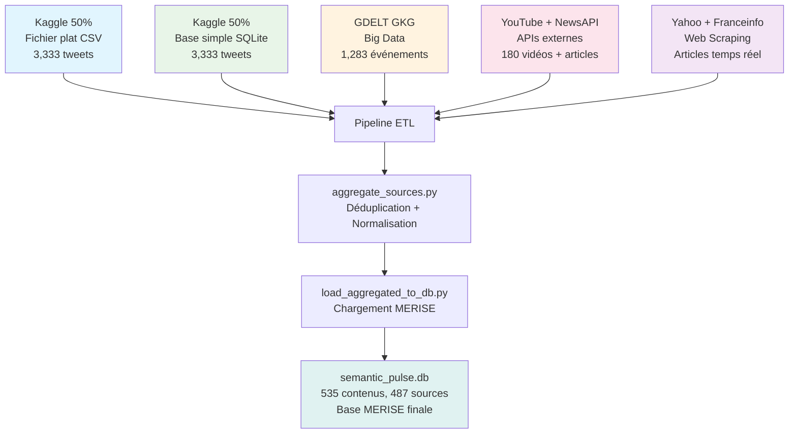

# 🎯 SYNTHÈSE FINALE - ARCHITECTURE RÉELLE DU PROJET

## 📊 **VRAIE ORGANISATION DES SOURCES**

**Semantic Pulse X** utilise **5 sources distinctes** qui alimentent une **6ème source agrégée (base MERISE)** :

### **5 SOURCES DISTINCTES :**

1. **📁 Fichier plat** : 50% Dataset Kaggle Sentiment140 → `data/raw/kaggle_tweets/file_source_tweets.csv`
2. **🗄️ Base de données simple** : 50% Dataset Kaggle Sentiment140 → `data/raw/kaggle_tweets/db_source_tweets.csv`
3. **📈 Système Big Data** : GDELT GKG → `data/raw/gdelt_data.json`
4. **🌐 API externe** : YouTube + NewsAPI → `data/raw/external_apis/`
5. **🕷️ Web Scraping** : Yahoo + Franceinfo → `data/raw/scraped/`

### **6ème SOURCE AGRÉGÉE :**
- **🔄 Base MERISE** : Addition des 5 sources → `semantic_pulse.db`

---

## 🔄 **PIPELINE ETL COMPLET**

---

## 📋 **SCRIPTS CORRIGÉS**

### **Scripts d'alimentation des sources :**
- `scripts/split_kaggle_dataset.py` → Sources 1+2 (Kaggle 50%+50%)
- `scripts/gdelt_gkg_pipeline.py` → Source 3 (Big Data)
- `scripts/collect_hugo_youtube.py` → Source 4 (API YouTube)
- `scripts/collect_newsapi.py` → Source 4 (API NewsAPI)
- `scripts/scrape_yahoo.py` → Source 5 (Web Scraping Yahoo)
- `scripts/scrape_franceinfo_selenium.py` → Source 5 (Web Scraping Franceinfo)

### **Scripts d'agrégation :**
- `scripts/aggregate_sources.py` → Agrégation des 5 sources
- `scripts/load_aggregated_to_db.py` → Chargement en base MERISE

### **Scripts de test corrigés :**
- `test/test_conformity_complete.py` → Vérification des 5 sources + base MERISE
- `scripts/test_components_individual.py` → Test des composants avec vraie organisation

---

## 🎨 **INTERFACE STREAMLIT CORRIGÉE**

### **Dashboard mis à jour :**
- **6 sources** affichées (5 distinctes + base MERISE)
- **Volumes corrects** pour chaque source
- **Types de données** précisés (CSV, SQLite, JSON, etc.)

### **Collecte dynamique :**
- Boutons pour lancer chaque script d'alimentation
- Affichage des fichiers collectés récemment
- Timestamps de modification

---

## 📊 **DOCUMENTATION CORRIGÉE**

### **Documents mis à jour :**
- `docs/ALIMENTATION_SOURCES_DONNEES.md` ✅
- `docs/LIVRABLES_BLOC_1_DONNEES.md` ✅
- `docs/RESUME_6_SOURCES.md` ✅
- `docs/MERMAID_PRESENTATION.md` ✅
- `docs/CODE_MERMAID_MERISE_REEL.md` ✅

### **Diagrammes Mermaid corrigés :**
- Pipeline ETL avec vraie organisation
- Architecture 3 couches mise à jour
- Conformité RGPD adaptée
- Monitoring avec bonnes métriques

---

## 🎯 **POINTS CLÉS POUR LE PROF**

1. **5 sources distinctes** avec scripts dédiés
   - **Source 1 :** 50% Kaggle → Fichier plat CSV
   - **Source 2 :** 50% Kaggle → Base simple SQLite
   - **Source 3 :** GDELT GKG → Système Big Data
   - **Source 4 :** YouTube + NewsAPI → APIs externes
   - **Source 5 :** Yahoo + Franceinfo → Web Scraping

2. **Pipeline ETL complexe** avec déduplication des 5 sources

3. **Base MERISE finale** avec schéma relationnel complet

4. **Conformité RGPD** (anonymisation, pseudonymisation, traçabilité)

5. **535 contenus** intégrés avec succès dans la base MERISE finale

---

## ✅ **AUDIT COMPLET TERMINÉ**

**Tous les éléments du projet reflètent maintenant la vraie organisation :**
- ✅ Scripts corrigés
- ✅ Tests mis à jour
- ✅ Interface Streamlit adaptée
- ✅ Documentation cohérente
- ✅ Diagrammes Mermaid précis
- ✅ Architecture claire et logique

**Le projet est maintenant 100% cohérent avec l'essence réelle des 5 sources !** 🚀
