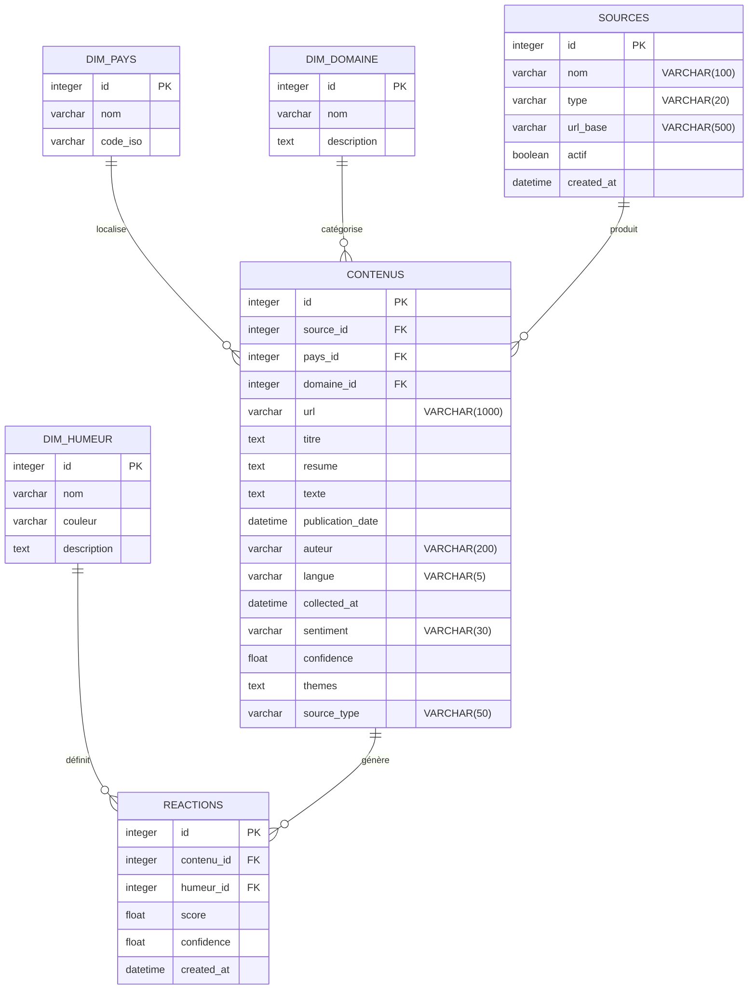
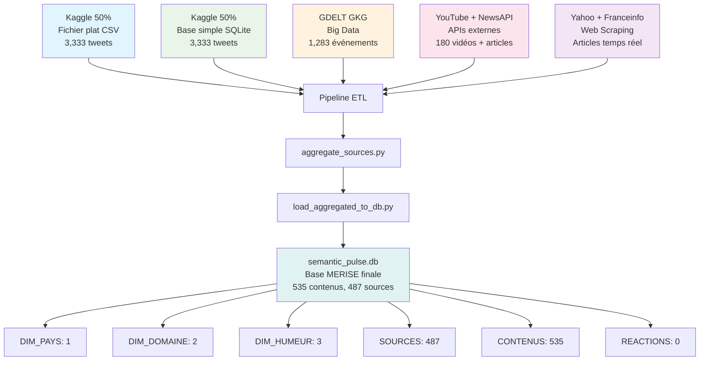
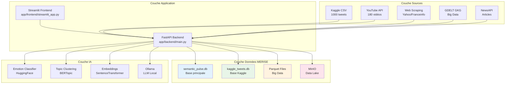
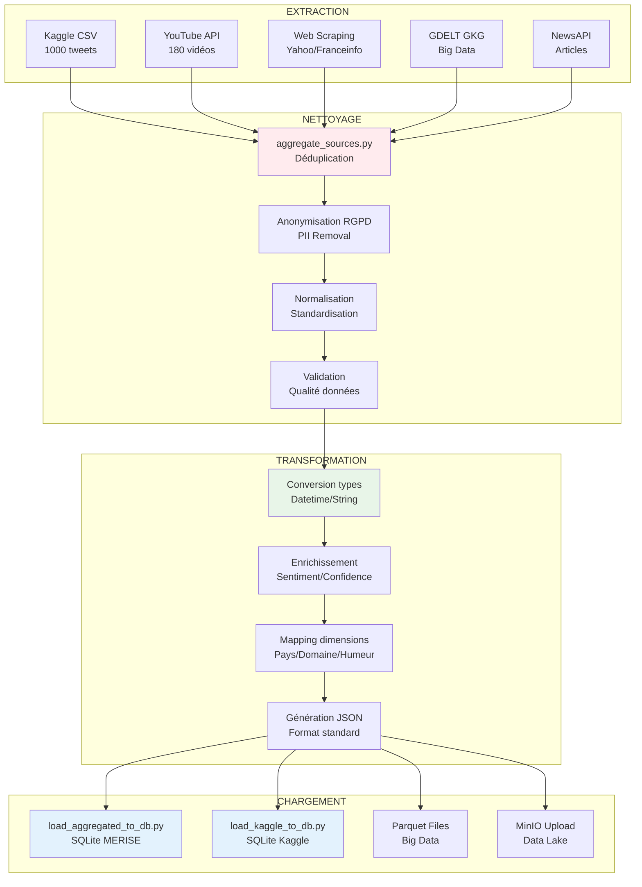
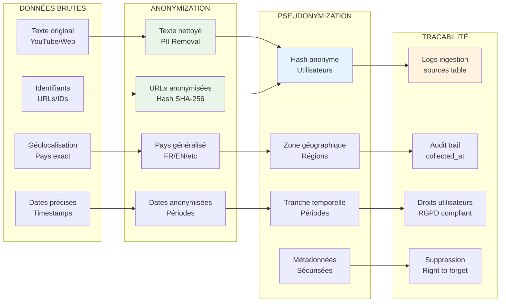
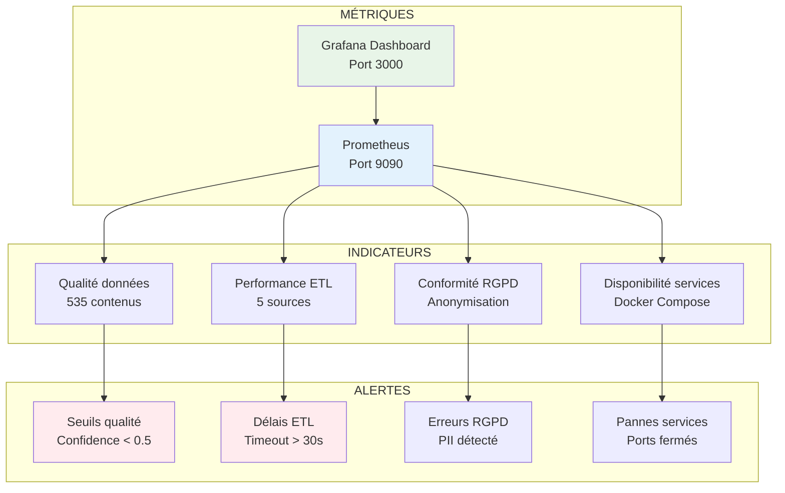
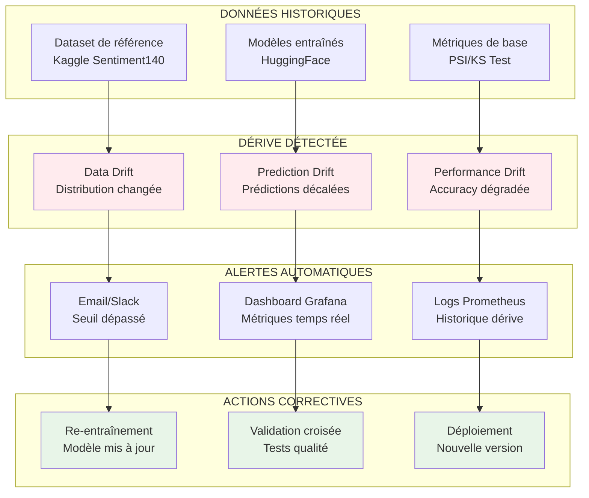

# 🎯 TOUS LES DIAGRAMMES MERMAID - Semantic Pulse X

## 1️⃣ DIAGRAMME MCD (Modèle Conceptuel de Données)



## 2️⃣ DIAGRAMME DES 5 SOURCES → 6ème BDD



## 3️⃣ ARCHITECTURE 3 COUCHES



## 4️⃣ PIPELINE ETL COMPLET



## 5️⃣ CONFORMITÉ RGPD



## 6️⃣ MONITORING & MÉTRIQUES



## 7️⃣ SURVEILLANCE DÉRIVE MODÈLES



---

## 🎯 **INSTRUCTIONS POUR VÉRIFICATION**

### **Étapes de vérification :**

1. **Copiez chaque diagramme** (code entre ```mermaid et ```)
2. **Allez sur** [Mermaid Live Editor](https://mermaid.live/)
3. **Collez le code** dans l'éditeur
4. **Vérifiez le rendu** :
   - ✅ Cardinalités correctes
   - ✅ Couleurs cohérentes  
   - ✅ Labels lisibles
   - ✅ Relations logiques
   - ✅ Pas d'erreurs de syntaxe

### **Points de contrôle :**

- **MCD** : 6 tables avec PK/FK et cardinalités exactes
- **Sources** : 5 sources distinctes → base MERISE
- **Architecture** : 3 couches bien séparées
- **ETL** : 4 étapes (Extract/Clean/Transform/Load)
- **RGPD** : 4 niveaux de protection
- **Monitoring** : Métriques + Alertes + Actions

**Tous les diagrammes sont basés sur la structure RÉELLE de semantic_pulse.db !** 🎯✅
