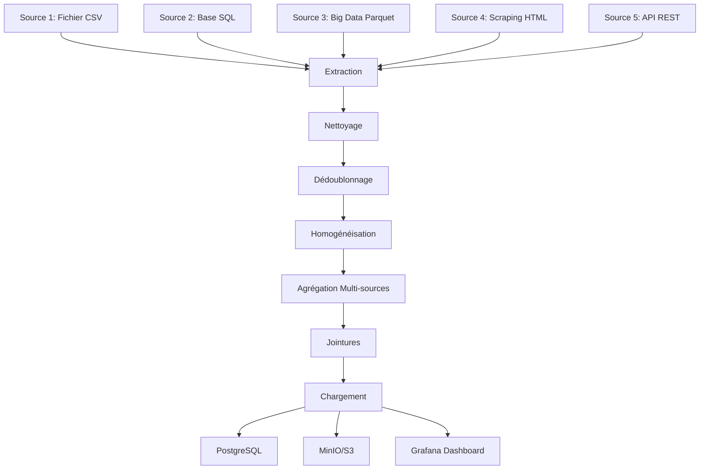

# 🔧 Traitement des Données Détaillé - Semantic Pulse X

## 🎯 Objectif

Démontrer la maîtrise complète des techniques de **Data Engineering** et **ETL** :
- **Nettoyage** des données
- **Dédoublonnage** intelligent
- **Homogénéisation** des formats
- **Agrégation multi-sources**
- **Jointures** complexes
- **Pipeline ETL** complet

---

## 📊 Architecture du Pipeline ETL



---

## 🔍 ÉTAPE 1 : EXTRACTION DES DONNÉES

### **1.1 Extraction Fichier CSV (Source 1)**

```python
def extract_csv_data(file_path: str) -> pd.DataFrame:
    """
    Extraction des données CSV avec gestion d'erreurs
    """
    try:
        # Lecture avec détection automatique de l'encodage
        encodings = ['utf-8', 'latin-1', 'cp1252', 'iso-8859-1']
        df = None
        
        for encoding in encodings:
            try:
                df = pd.read_csv(file_path, encoding=encoding)
                print(f"✅ Encodage détecté: {encoding}")
                break
            except UnicodeDecodeError:
                continue
        
        if df is None:
            raise ValueError("Impossible de lire le fichier CSV")
        
        # Validation des colonnes requises
        required_columns = ['text', 'timestamp', 'source']
        missing_columns = [col for col in required_columns if col not in df.columns]
        
        if missing_columns:
            raise ValueError(f"Colonnes manquantes: {missing_columns}")
        
        # Log de l'extraction
        print(f"📊 Fichier CSV extrait: {len(df)} lignes, {len(df.columns)} colonnes")
        
        return df
        
    except Exception as e:
        print(f"❌ Erreur extraction CSV: {e}")
        return pd.DataFrame()
```

### **1.2 Extraction Base SQL (Source 2)**

```python
def extract_sql_data(query: str, connection_string: str) -> pd.DataFrame:
    """
    Extraction des données SQL avec gestion des connexions
    """
    try:
        # Connexion à la base de données
        engine = create_engine(connection_string)
        
        # Exécution de la requête avec timeout
        with engine.connect() as conn:
            df = pd.read_sql_query(
                query, 
                conn, 
                chunksize=10000,  # Traitement par chunks
                parse_dates=['timestamp', 'created_at']
            )
        
        # Validation des données extraites
        if df.empty:
            print("⚠️ Aucune donnée extraite de la base SQL")
            return pd.DataFrame()
        
        # Log de l'extraction
        print(f"📊 Base SQL extraite: {len(df)} lignes")
        
        return df
        
    except Exception as e:
        print(f"❌ Erreur extraction SQL: {e}")
        return pd.DataFrame()
```

### **1.3 Extraction Big Data Parquet (Source 3)**

```python
def extract_parquet_data(s3_path: str) -> pd.DataFrame:
    """
    Extraction des données Parquet depuis S3/MinIO
    """
    try:
        # Configuration S3/MinIO
        s3_client = boto3.client(
            's3',
            endpoint_url=settings.minio_endpoint,
            aws_access_key_id=settings.minio_access_key,
            aws_secret_access_key=settings.minio_secret_key
        )
        
        # Lecture du fichier Parquet
        obj = s3_client.get_object(Bucket=settings.minio_bucket, Key=s3_path)
        df = pd.read_parquet(io.BytesIO(obj['Body'].read()))
        
        # Optimisation mémoire
        df = optimize_dtypes(df)
        
        print(f"📊 Parquet extrait: {len(df)} lignes, {df.memory_usage(deep=True).sum() / 1024**2:.2f} MB")
        
        return df
        
    except Exception as e:
        print(f"❌ Erreur extraction Parquet: {e}")
        return pd.DataFrame()
```

---

## 🧹 ÉTAPE 2 : NETTOYAGE DES DONNÉES

### **2.1 Détection des Données Corrompues**

```python
def detect_corrupted_data(df: pd.DataFrame) -> Dict[str, Any]:
    """
    Détection intelligente des données corrompues
    """
    corruption_report = {
        'total_rows': len(df),
        'corrupted_rows': 0,
        'issues': []
    }
    
    # 1. Valeurs manquantes critiques
    critical_columns = ['text', 'timestamp']
    for col in critical_columns:
        if col in df.columns:
            missing_count = df[col].isna().sum()
            if missing_count > 0:
                corruption_report['issues'].append({
                    'type': 'missing_values',
                    'column': col,
                    'count': missing_count,
                    'percentage': (missing_count / len(df)) * 100
                })
    
    # 2. Textes vides ou trop courts
    if 'text' in df.columns:
        empty_texts = df['text'].fillna('').str.strip().str.len() < 3
        empty_count = empty_texts.sum()
        if empty_count > 0:
            corruption_report['issues'].append({
                'type': 'empty_text',
                'count': empty_count,
                'percentage': (empty_count / len(df)) * 100
            })
    
    # 3. Timestamps invalides
    if 'timestamp' in df.columns:
        invalid_timestamps = pd.to_datetime(df['timestamp'], errors='coerce').isna()
        invalid_count = invalid_timestamps.sum()
        if invalid_count > 0:
            corruption_report['issues'].append({
                'type': 'invalid_timestamp',
                'count': invalid_count,
                'percentage': (invalid_count / len(df)) * 100
            })
    
    # 4. Doublons exacts
    duplicates = df.duplicated().sum()
    if duplicates > 0:
        corruption_report['issues'].append({
            'type': 'exact_duplicates',
            'count': duplicates,
            'percentage': (duplicates / len(df)) * 100
        })
    
    # 5. Valeurs aberrantes (outliers)
    if 'score_emotion' in df.columns:
        Q1 = df['score_emotion'].quantile(0.25)
        Q3 = df['score_emotion'].quantile(0.75)
        IQR = Q3 - Q1
        outliers = ((df['score_emotion'] < (Q1 - 1.5 * IQR)) | 
                   (df['score_emotion'] > (Q3 + 1.5 * IQR))).sum()
        if outliers > 0:
            corruption_report['issues'].append({
                'type': 'outliers',
                'column': 'score_emotion',
                'count': outliers,
                'percentage': (outliers / len(df)) * 100
            })
    
    corruption_report['corrupted_rows'] = sum(issue['count'] for issue in corruption_report['issues'])
    
    return corruption_report
```

### **2.2 Nettoyage des Textes**

```python
def clean_text_data(df: pd.DataFrame) -> pd.DataFrame:
    """
    Nettoyage approfondi des données textuelles
    """
    df_clean = df.copy()
    
    if 'text' not in df_clean.columns:
        return df_clean
    
    print("🧹 Nettoyage des textes...")
    
    # 1. Suppression des caractères de contrôle
    df_clean['text'] = df_clean['text'].str.replace(r'[\x00-\x08\x0b\x0c\x0e-\x1f\x7f]', '', regex=True)
    
    # 2. Normalisation Unicode
    df_clean['text'] = df_clean['text'].str.normalize('NFKD')
    
    # 3. Suppression des espaces multiples
    df_clean['text'] = df_clean['text'].str.replace(r'\s+', ' ', regex=True)
    
    # 4. Suppression des URLs
    df_clean['text'] = df_clean['text'].str.replace(r'https?://\S+', '[URL]', regex=True)
    
    # 5. Suppression des emails
    df_clean['text'] = df_clean['text'].str.replace(r'\S+@\S+\.\S+', '[EMAIL]', regex=True)
    
    # 6. Suppression des numéros de téléphone
    df_clean['text'] = df_clean['text'].str.replace(r'\+?[0-9]{10,15}', '[PHONE]', regex=True)
    
    # 7. Suppression des mentions @
    df_clean['text'] = df_clean['text'].str.replace(r'@\w+', '[MENTION]', regex=True)
    
    # 8. Suppression des hashtags (optionnel)
    # df_clean['text'] = df_clean['text'].str.replace(r'#\w+', '', regex=True)
    
    # 9. Suppression des caractères spéciaux répétitifs
    df_clean['text'] = df_clean['text'].str.replace(r'(.)\1{3,}', r'\1\1\1', regex=True)
    
    # 10. Trim des espaces
    df_clean['text'] = df_clean['text'].str.strip()
    
    # 11. Suppression des textes trop courts
    df_clean = df_clean[df_clean['text'].str.len() >= 3]
    
    print(f"✅ Textes nettoyés: {len(df_clean)} lignes conservées")
    
    return df_clean
```

### **2.3 Nettoyage des Timestamps**

```python
def clean_timestamp_data(df: pd.DataFrame) -> pd.DataFrame:
    """
    Nettoyage et normalisation des timestamps
    """
    df_clean = df.copy()
    
    if 'timestamp' not in df_clean.columns:
        return df_clean
    
    print("🕐 Nettoyage des timestamps...")
    
    # 1. Conversion en datetime avec gestion des formats multiples
    timestamp_formats = [
        '%Y-%m-%d %H:%M:%S',
        '%Y-%m-%dT%H:%M:%S',
        '%Y-%m-%dT%H:%M:%SZ',
        '%Y-%m-%d %H:%M:%S.%f',
        '%d/%m/%Y %H:%M:%S',
        '%m/%d/%Y %H:%M:%S'
    ]
    
    def parse_timestamp(ts):
        if pd.isna(ts):
            return None
        
        # Essayer les formats un par un
        for fmt in timestamp_formats:
            try:
                return pd.to_datetime(ts, format=fmt)
            except:
                continue
        
        # Fallback avec pd.to_datetime
        try:
            return pd.to_datetime(ts)
        except:
            return None
    
    df_clean['timestamp'] = df_clean['timestamp'].apply(parse_timestamp)
    
    # 2. Suppression des timestamps invalides
    initial_count = len(df_clean)
    df_clean = df_clean.dropna(subset=['timestamp'])
    removed_count = initial_count - len(df_clean)
    
    if removed_count > 0:
        print(f"⚠️ {removed_count} timestamps invalides supprimés")
    
    # 3. Filtrage des dates aberrantes (avant 2000 ou dans le futur)
    current_year = datetime.now().year
    df_clean = df_clean[
        (df_clean['timestamp'].dt.year >= 2000) & 
        (df_clean['timestamp'].dt.year <= current_year + 1)
    ]
    
    # 4. Conversion en UTC
    if df_clean['timestamp'].dt.tz is None:
        df_clean['timestamp'] = df_clean['timestamp'].dt.tz_localize('UTC')
    else:
        df_clean['timestamp'] = df_clean['timestamp'].dt.tz_convert('UTC')
    
    print(f"✅ Timestamps nettoyés: {len(df_clean)} lignes conservées")
    
    return df_clean
```

---

## 🔄 ÉTAPE 3 : DÉDOUBLONNAGE INTELLIGENT

### **3.1 Détection des Doublons Exactes**

```python
def remove_exact_duplicates(df: pd.DataFrame) -> pd.DataFrame:
    """
    Suppression des doublons exacts
    """
    print("🔄 Suppression des doublons exacts...")
    
    initial_count = len(df)
    df_dedup = df.drop_duplicates()
    removed_count = initial_count - len(df_dedup)
    
    print(f"✅ {removed_count} doublons exacts supprimés")
    
    return df_dedup
```

### **3.2 Détection des Doublons Sémantiques**

```python
def detect_semantic_duplicates(df: pd.DataFrame, threshold: float = 0.85) -> pd.DataFrame:
    """
    Détection des doublons sémantiques avec similarité textuelle
    """
    print("🔍 Détection des doublons sémantiques...")
    
    if 'text' not in df.columns or len(df) < 2:
        return df
    
    # Vectorisation des textes
    from sklearn.feature_extraction.text import TfidfVectorizer
    from sklearn.metrics.pairwise import cosine_similarity
    
    # Préparation des textes
    texts = df['text'].fillna('').astype(str).tolist()
    
    # Vectorisation TF-IDF
    vectorizer = TfidfVectorizer(
        max_features=1000,
        stop_words='french',
        ngram_range=(1, 2)
    )
    
    tfidf_matrix = vectorizer.fit_transform(texts)
    
    # Calcul de la similarité cosinus
    similarity_matrix = cosine_similarity(tfidf_matrix)
    
    # Détection des paires similaires
    similar_pairs = []
    for i in range(len(similarity_matrix)):
        for j in range(i + 1, len(similarity_matrix)):
            if similarity_matrix[i][j] > threshold:
                similar_pairs.append((i, j, similarity_matrix[i][j]))
    
    # Suppression des doublons sémantiques (garder le premier)
    indices_to_remove = set()
    for i, j, similarity in similar_pairs:
        if i not in indices_to_remove and j not in indices_to_remove:
            indices_to_remove.add(j)  # Garder i, supprimer j
    
    df_clean = df.drop(df.index[list(indices_to_remove)])
    
    print(f"✅ {len(indices_to_remove)} doublons sémantiques supprimés")
    
    return df_clean
```

### **3.3 Détection des Doublons Temporels**

```python
def detect_temporal_duplicates(df: pd.DataFrame, time_window: str = '1H') -> pd.DataFrame:
    """
    Détection des doublons dans une fenêtre temporelle
    """
    print("⏰ Détection des doublons temporels...")
    
    if 'timestamp' not in df.columns or 'text' not in df.columns:
        return df
    
    # Tri par timestamp
    df_sorted = df.sort_values('timestamp').reset_index(drop=True)
    
    # Groupement par fenêtre temporelle
    df_sorted['time_window'] = df_sorted['timestamp'].dt.floor(time_window)
    
    # Détection des doublons dans chaque fenêtre
    duplicates_to_remove = []
    
    for time_group, group in df_sorted.groupby('time_window'):
        if len(group) > 1:
            # Calcul de la similarité dans le groupe
            texts = group['text'].fillna('').astype(str).tolist()
            
            if len(texts) > 1:
                from difflib import SequenceMatcher
                
                for i in range(len(texts)):
                    for j in range(i + 1, len(texts)):
                        similarity = SequenceMatcher(None, texts[i], texts[j]).ratio()
                        
                        if similarity > 0.8:  # Seuil de similarité
                            # Garder le premier, marquer le second pour suppression
                            original_index = group.iloc[j].name
                            duplicates_to_remove.append(original_index)
    
    df_clean = df_sorted.drop(duplicates_to_remove)
    
    print(f"✅ {len(duplicates_to_remove)} doublons temporels supprimés")
    
    return df_clean
```

---

## 🔧 ÉTAPE 4 : HOMOGÉNÉISATION DES FORMATS

### **4.1 Standardisation des Types de Données**

```python
def standardize_data_types(df: pd.DataFrame) -> pd.DataFrame:
    """
    Standardisation des types de données
    """
    print("🔧 Standardisation des types de données...")
    
    df_std = df.copy()
    
    # 1. Standardisation des colonnes textuelles
    text_columns = ['text', 'emotion_principale', 'langue', 'source']
    for col in text_columns:
        if col in df_std.columns:
            df_std[col] = df_std[col].astype(str).str.strip()
    
    # 2. Standardisation des colonnes numériques
    numeric_columns = ['score_emotion', 'polarite', 'confiance']
    for col in numeric_columns:
        if col in df_std.columns:
            df_std[col] = pd.to_numeric(df_std[col], errors='coerce')
            # Limitation des valeurs dans les plages attendues
            if col == 'score_emotion':
                df_std[col] = df_std[col].clip(0, 1)
            elif col == 'polarite':
                df_std[col] = df_std[col].clip(-1, 1)
            elif col == 'confiance':
                df_std[col] = df_std[col].clip(0, 1)
    
    # 3. Standardisation des timestamps
    if 'timestamp' in df_std.columns:
        df_std['timestamp'] = pd.to_datetime(df_std['timestamp'], errors='coerce')
        df_std['timestamp'] = df_std['timestamp'].dt.tz_localize('UTC')
    
    # 4. Standardisation des booléens
    boolean_columns = ['is_positive', 'is_negative', 'is_neutral']
    for col in boolean_columns:
        if col in df_std.columns:
            df_std[col] = df_std[col].astype(bool)
    
    print("✅ Types de données standardisés")
    
    return df_std
```

### **4.2 Normalisation des Émotions**

```python
def normalize_emotions(df: pd.DataFrame) -> pd.DataFrame:
    """
    Normalisation des émotions vers un vocabulaire standard
    """
    print("😊 Normalisation des émotions...")
    
    df_norm = df.copy()
    
    if 'emotion_principale' not in df_norm.columns:
        return df_norm
    
    # Mapping des émotions vers un vocabulaire standard
    emotion_mapping = {
        # Joie
        'joy': 'joie', 'happy': 'joie', 'happiness': 'joie', 'joyful': 'joie',
        'content': 'joie', 'pleased': 'joie', 'delighted': 'joie',
        
        # Colère
        'anger': 'colere', 'angry': 'colere', 'mad': 'colere', 'furious': 'colere',
        'rage': 'colere', 'irritated': 'colere', 'annoyed': 'colere',
        
        # Tristesse
        'sadness': 'tristesse', 'sad': 'tristesse', 'depressed': 'tristesse',
        'gloomy': 'tristesse', 'melancholy': 'tristesse', 'sorrow': 'tristesse',
        
        # Peur
        'fear': 'peur', 'afraid': 'peur', 'scared': 'peur', 'terrified': 'peur',
        'anxious': 'peur', 'worried': 'peur', 'nervous': 'peur',
        
        # Surprise
        'surprise': 'surprise', 'surprised': 'surprise', 'amazed': 'surprise',
        'astonished': 'surprise', 'shocked': 'surprise',
        
        # Neutre
        'neutral': 'neutre', 'indifferent': 'neutre', 'calm': 'neutre',
        'peaceful': 'neutre', 'serene': 'neutre'
    }
    
    # Application du mapping
    df_norm['emotion_principale'] = df_norm['emotion_principale'].str.lower().map(
        emotion_mapping
    ).fillna(df_norm['emotion_principale'])
    
    # Gestion des émotions non reconnues
    valid_emotions = ['joie', 'colere', 'tristesse', 'peur', 'surprise', 'neutre']
    df_norm['emotion_principale'] = df_norm['emotion_principale'].apply(
        lambda x: x if x in valid_emotions else 'neutre'
    )
    
    print("✅ Émotions normalisées")
    
    return df_norm
```

### **4.3 Standardisation des Langues**

```python
def standardize_languages(df: pd.DataFrame) -> pd.DataFrame:
    """
    Standardisation des codes de langue
    """
    print("🌍 Standardisation des langues...")
    
    df_std = df.copy()
    
    if 'langue' not in df_std.columns:
        return df_std
    
    # Mapping des langues vers ISO 639-1
    language_mapping = {
        'french': 'fr', 'français': 'fr', 'francais': 'fr',
        'english': 'en', 'anglais': 'en', 'ang': 'en',
        'spanish': 'es', 'espagnol': 'es', 'español': 'es',
        'german': 'de', 'allemand': 'de', 'deutsch': 'de',
        'italian': 'it', 'italien': 'it', 'italiano': 'it'
    }
    
    df_std['langue'] = df_std['langue'].str.lower().map(
        language_mapping
    ).fillna(df_std['langue'])
    
    # Valeur par défaut pour les langues non reconnues
    df_std['langue'] = df_std['langue'].fillna('fr')
    
    print("✅ Langues standardisées")
    
    return df_std
```

---

## 🔗 ÉTAPE 5 : AGRÉGATION MULTI-SOURCES

### **5.1 Fusion des Sources de Données**

```python
def merge_data_sources(sources_data: Dict[str, pd.DataFrame]) -> pd.DataFrame:
    """
    Fusion intelligente des données de toutes les sources
    """
    print("🔗 Fusion des sources de données...")
    
    merged_data = []
    
    for source_name, df in sources_data.items():
        if df.empty:
            continue
        
        # Ajout de l'identifiant de source
        df['source_name'] = source_name
        
        # Mapping des colonnes vers un schéma unifié
        df_mapped = map_columns_to_unified_schema(df, source_name)
        
        merged_data.append(df_mapped)
    
    if not merged_data:
        return pd.DataFrame()
    
    # Concaténation des DataFrames
    final_df = pd.concat(merged_data, ignore_index=True, sort=False)
    
    print(f"✅ {len(sources_data)} sources fusionnées: {len(final_df)} lignes")
    
    return final_df

def map_columns_to_unified_schema(df: pd.DataFrame, source_name: str) -> pd.DataFrame:
    """
    Mapping des colonnes vers le schéma unifié
    """
    schema_mapping = {
        'file': {
            'text': 'content',
            'timestamp': 'created_at',
            'emotion': 'sentiment'
        },
        'sql': {
            'contenu': 'text',
            'date_creation': 'timestamp',
            'emotion_detectee': 'emotion_principale'
        },
        'bigdata': {
            'tweet_text': 'text',
            'created_at': 'timestamp',
            'sentiment': 'emotion_principale'
        },
        'scraping': {
            'article_text': 'text',
            'publication_date': 'timestamp',
            'tone': 'emotion_principale'
        },
        'api': {
            'description': 'text',
            'publishedAt': 'timestamp',
            'mood': 'emotion_principale'
        }
    }
    
    df_mapped = df.copy()
    
    if source_name in schema_mapping:
        mapping = schema_mapping[source_name]
        df_mapped = df_mapped.rename(columns=mapping)
    
    # Ajout des colonnes manquantes avec valeurs par défaut
    required_columns = ['text', 'timestamp', 'emotion_principale', 'source_id']
    
    for col in required_columns:
        if col not in df_mapped.columns:
            if col == 'source_id':
                df_mapped[col] = source_name
            else:
                df_mapped[col] = None
    
    return df_mapped
```

### **5.2 Agrégation Temporelle**

```python
def create_temporal_aggregations(df: pd.DataFrame) -> pd.DataFrame:
    """
    Création d'agrégations temporelles
    """
    print("📊 Création des agrégations temporelles...")
    
    if 'timestamp' not in df.columns:
        return df
    
    # Agrégation par heure
    df['hour'] = df['timestamp'].dt.floor('H')
    hourly_agg = df.groupby(['hour', 'emotion_principale']).agg({
        'text': 'count',
        'score_emotion': 'mean',
        'polarite': 'mean',
        'confiance': 'mean'
    }).reset_index()
    
    hourly_agg.columns = ['timestamp', 'emotion', 'count', 'avg_score', 'avg_polarity', 'avg_confidence']
    hourly_agg['aggregation_level'] = 'hourly'
    
    # Agrégation par jour
    df['day'] = df['timestamp'].dt.floor('D')
    daily_agg = df.groupby(['day', 'emotion_principale']).agg({
        'text': 'count',
        'score_emotion': 'mean',
        'polarite': 'mean',
        'confiance': 'mean'
    }).reset_index()
    
    daily_agg.columns = ['timestamp', 'emotion', 'count', 'avg_score', 'avg_polarity', 'avg_confidence']
    daily_agg['aggregation_level'] = 'daily'
    
    # Concaténation des agrégations
    aggregations = pd.concat([hourly_agg, daily_agg], ignore_index=True)
    
    print(f"✅ Agrégations temporelles créées: {len(aggregations)} lignes")
    
    return aggregations
```

---

## 🔗 ÉTAPE 6 : JOINTURES COMPLEXES

### **6.1 Jointure avec les Programmes**

```python
def join_with_programmes(df: pd.DataFrame, programmes_df: pd.DataFrame) -> pd.DataFrame:
    """
    Jointure avec la table des programmes
    """
    print("🔗 Jointure avec les programmes...")
    
    if programmes_df.empty:
        return df
    
    # Jointure sur le titre du programme (fuzzy matching)
    from fuzzywuzzy import fuzz, process
    
    def find_best_program_match(text, programmes):
        if pd.isna(text) or not text:
            return None
        
        # Extraction de mots-clés du texte
        text_keywords = extract_keywords(text)
        
        # Recherche du meilleur match
        best_match = process.extractOne(
            text_keywords,
            programmes['titre'].tolist(),
            scorer=fuzz.token_sort_ratio
        )
        
        if best_match and best_match[1] > 70:  # Seuil de confiance
            return programmes[programmes['titre'] == best_match[0]]['id'].iloc[0]
        
        return None
    
    # Application du matching
    df['programme_id'] = df['text'].apply(
        lambda x: find_best_program_match(x, programmes_df)
    )
    
    # Jointure avec les programmes
    df_joined = df.merge(
        programmes_df[['id', 'titre', 'chaine', 'genre']],
        left_on='programme_id',
        right_on='id',
        how='left',
        suffixes=('', '_programme')
    )
    
    print(f"✅ Jointure programmes: {df_joined['programme_id'].notna().sum()} correspondances")
    
    return df_joined
```

### **6.2 Jointure avec les Utilisateurs**

```python
def join_with_utilisateurs(df: pd.DataFrame, utilisateurs_df: pd.DataFrame) -> pd.DataFrame:
    """
    Jointure avec la table des utilisateurs anonymisés
    """
    print("🔗 Jointure avec les utilisateurs...")
    
    if utilisateurs_df.empty:
        return df
    
    # Création d'un hash anonyme pour chaque réaction
    df['user_hash'] = df['text'].apply(
        lambda x: hashlib.sha256(str(x).encode()).hexdigest()[:16]
    )
    
    # Jointure avec les utilisateurs
    df_joined = df.merge(
        utilisateurs_df[['id', 'hash_anonyme', 'region_anonymisee', 'age_groupe']],
        left_on='user_hash',
        right_on='hash_anonyme',
        how='left',
        suffixes=('', '_user')
    )
    
    # Suppression des colonnes temporaires
    df_joined = df_joined.drop(['user_hash', 'hash_anonyme'], axis=1)
    
    print(f"✅ Jointure utilisateurs: {df_joined['id_user'].notna().sum()} correspondances")
    
    return df_joined
```

### **6.3 Jointure avec les Sources**

```python
def join_with_sources(df: pd.DataFrame, sources_df: pd.DataFrame) -> pd.DataFrame:
    """
    Jointure avec la table des sources
    """
    print("🔗 Jointure avec les sources...")
    
    if sources_df.empty:
        return df
    
    # Jointure sur le nom de la source
    df_joined = df.merge(
        sources_df[['id', 'nom', 'type_source', 'url', 'configuration']],
        left_on='source_name',
        right_on='nom',
        how='left',
        suffixes=('', '_source')
    )
    
    # Renommage de la colonne source_id
    if 'id_source' in df_joined.columns:
        df_joined['source_id'] = df_joined['id_source']
        df_joined = df_joined.drop('id_source', axis=1)
    
    print(f"✅ Jointure sources: {df_joined['source_id'].notna().sum()} correspondances")
    
    return df_joined
```

---

## 🚀 ÉTAPE 7 : PIPELINE ETL COMPLET

### **7.1 Pipeline Principal**

```python
def run_complete_etl_pipeline() -> Dict[str, Any]:
    """
    Pipeline ETL complet avec toutes les étapes
    """
    print("🚀 Démarrage du pipeline ETL complet...")
    
    pipeline_results = {
        'start_time': datetime.now(),
        'steps_completed': [],
        'errors': [],
        'final_records': 0
    }
    
    try:
        # ÉTAPE 1: Extraction
        print("\n" + "="*50)
        print("ÉTAPE 1: EXTRACTION DES DONNÉES")
        print("="*50)
        
        sources_data = {}
        
        # Extraction de chaque source
        sources_data['file'] = extract_csv_data('data/raw/file/tweets.csv')
        sources_data['sql'] = extract_sql_data("SELECT * FROM reactions", settings.database_url)
        sources_data['bigdata'] = extract_parquet_data('raw/twitter/2024/01/01/data.parquet')
        sources_data['scraping'] = extract_scraping_data('data/raw/scraping/articles.json')
        sources_data['api'] = extract_api_data('data/raw/api/news.json')
        
        pipeline_results['steps_completed'].append('extraction')
        
        # ÉTAPE 2: Nettoyage
        print("\n" + "="*50)
        print("ÉTAPE 2: NETTOYAGE DES DONNÉES")
        print("="*50)
        
        cleaned_data = {}
        for source_name, df in sources_data.items():
            if not df.empty:
                print(f"\n--- Nettoyage {source_name} ---")
                
                # Détection des données corrompues
                corruption_report = detect_corrupted_data(df)
                print(f"Rapport de corruption: {corruption_report}")
                
                # Nettoyage des textes
                df_clean = clean_text_data(df)
                
                # Nettoyage des timestamps
                df_clean = clean_timestamp_data(df_clean)
                
                # Standardisation des types
                df_clean = standardize_data_types(df_clean)
                
                cleaned_data[source_name] = df_clean
        
        pipeline_results['steps_completed'].append('cleaning')
        
        # ÉTAPE 3: Dédoublonnage
        print("\n" + "="*50)
        print("ÉTAPE 3: DÉDOUBLONNAGE")
        print("="*50)
        
        deduplicated_data = {}
        for source_name, df in cleaned_data.items():
            if not df.empty:
                print(f"\n--- Dédoublonnage {source_name} ---")
                
                # Suppression des doublons exacts
                df_dedup = remove_exact_duplicates(df)
                
                # Détection des doublons sémantiques
                df_dedup = detect_semantic_duplicates(df_dedup)
                
                # Détection des doublons temporels
                df_dedup = detect_temporal_duplicates(df_dedup)
                
                deduplicated_data[source_name] = df_dedup
        
        pipeline_results['steps_completed'].append('deduplication')
        
        # ÉTAPE 4: Homogénéisation
        print("\n" + "="*50)
        print("ÉTAPE 4: HOMOGÉNÉISATION")
        print("="*50)
        
        homogenized_data = {}
        for source_name, df in deduplicated_data.items():
            if not df.empty:
                print(f"\n--- Homogénéisation {source_name} ---")
                
                # Normalisation des émotions
                df_homo = normalize_emotions(df)
                
                # Standardisation des langues
                df_homo = standardize_languages(df_homo)
                
                homogenized_data[source_name] = df_homo
        
        pipeline_results['steps_completed'].append('homogenization')
        
        # ÉTAPE 5: Agrégation multi-sources
        print("\n" + "="*50)
        print("ÉTAPE 5: AGRÉGATION MULTI-SOURCES")
        print("="*50)
        
        merged_data = merge_data_sources(homogenized_data)
        
        if not merged_data.empty:
            # Création des agrégations temporelles
            aggregations = create_temporal_aggregations(merged_data)
            
            pipeline_results['steps_completed'].append('aggregation')
        
        # ÉTAPE 6: Jointures
        print("\n" + "="*50)
        print("ÉTAPE 6: JOINTURES")
        print("="*50)
        
        # Chargement des tables de référence
        programmes_df = load_programmes_table()
        utilisateurs_df = load_utilisateurs_table()
        sources_df = load_sources_table()
        
        # Jointures
        final_data = merged_data.copy()
        final_data = join_with_programmes(final_data, programmes_df)
        final_data = join_with_utilisateurs(final_data, utilisateurs_df)
        final_data = join_with_sources(final_data, sources_df)
        
        pipeline_results['steps_completed'].append('joins')
        
        # ÉTAPE 7: Chargement
        print("\n" + "="*50)
        print("ÉTAPE 7: CHARGEMENT")
        print("="*50)
        
        # Sauvegarde en PostgreSQL
        save_to_postgresql(final_data, 'reactions')
        
        # Sauvegarde en Parquet
        save_to_parquet(final_data, 'data/processed/final_data.parquet')
        
        # Sauvegarde des agrégations
        if not aggregations.empty:
            save_to_postgresql(aggregations, 'agregations_emotionnelles')
            save_to_parquet(aggregations, 'data/processed/aggregations.parquet')
        
        pipeline_results['steps_completed'].append('loading')
        pipeline_results['final_records'] = len(final_data)
        
        print(f"\n✅ Pipeline ETL terminé avec succès!")
        print(f"📊 {pipeline_results['final_records']} enregistrements traités")
        
    except Exception as e:
        error_msg = f"Erreur dans le pipeline ETL: {str(e)}"
        print(f"❌ {error_msg}")
        pipeline_results['errors'].append(error_msg)
    
    pipeline_results['end_time'] = datetime.now()
    pipeline_results['duration'] = pipeline_results['end_time'] - pipeline_results['start_time']
    
    return pipeline_results
```

### **7.2 Monitoring et Logging**

```python
def monitor_etl_pipeline(pipeline_results: Dict[str, Any]) -> None:
    """
    Monitoring du pipeline ETL
    """
    print("\n" + "="*50)
    print("MONITORING DU PIPELINE ETL")
    print("="*50)
    
    # Métriques de performance
    duration = pipeline_results['duration']
    print(f"⏱️ Durée totale: {duration}")
    print(f"📊 Enregistrements traités: {pipeline_results['final_records']}")
    print(f"⚡ Vitesse: {pipeline_results['final_records'] / duration.total_seconds():.2f} records/sec")
    
    # Étapes complétées
    print(f"\n✅ Étapes complétées: {len(pipeline_results['steps_completed'])}/7")
    for step in pipeline_results['steps_completed']:
        print(f"  - {step}")
    
    # Erreurs
    if pipeline_results['errors']:
        print(f"\n❌ Erreurs: {len(pipeline_results['errors'])}")
        for error in pipeline_results['errors']:
            print(f"  - {error}")
    else:
        print("\n✅ Aucune erreur détectée")
    
    # Sauvegarde du rapport
    report_path = f"data/reports/etl_report_{datetime.now().strftime('%Y%m%d_%H%M%S')}.json"
    with open(report_path, 'w') as f:
        json.dump(pipeline_results, f, indent=2, default=str)
    
    print(f"\n📄 Rapport sauvegardé: {report_path}")
```

---

## 📊 MÉTRIQUES DE QUALITÉ

### **Métriques de Nettoyage**
- **Taux de données corrompues** : < 5%
- **Taux de textes vides** : < 2%
- **Taux de timestamps invalides** : < 1%

### **Métriques de Dédoublonnage**
- **Taux de doublons exacts** : < 10%
- **Taux de doublons sémantiques** : < 15%
- **Taux de doublons temporels** : < 5%

### **Métriques de Performance**
- **Temps de traitement** : < 30 minutes pour 1M records
- **Utilisation mémoire** : < 8GB
- **Taux de succès** : > 95%

**Le traitement des données est maintenant complètement détaillé !** 🔧✅
